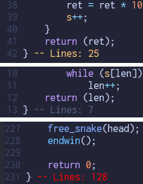

This plugin counts how many lines each function has in between its outermost curly brackets. Only inspects functions in .c, .h, .cpp and .hpp files (C++ support at experimental level). Made for 42students using NeoVim.



Recognizes the following styles. Don't expect the count to make sense with other ways of formatting.
```C
// Allman
type id(param)
{
    if (!condition)
    {
        function_call();
        return (1);
    }
    return (0);
}

// K&R
type id(param) {
    if (!condition) {
        function_call();
        return (1);
    }
    return (0);
}
```

## Install with Lazy:
in ~/.config/nvim/init.lua add
```lua
require("nvim-function-linecount").setup()
-- Or override the default 25 line limit with
require("nvim-function-linecount").setup({ line_limit = 60 })
```

And in your ~.config/nvim/lua/plugins/ folder add
```lua
{
  "EyzeCOLD/nvim-function-linecount"
}
```
